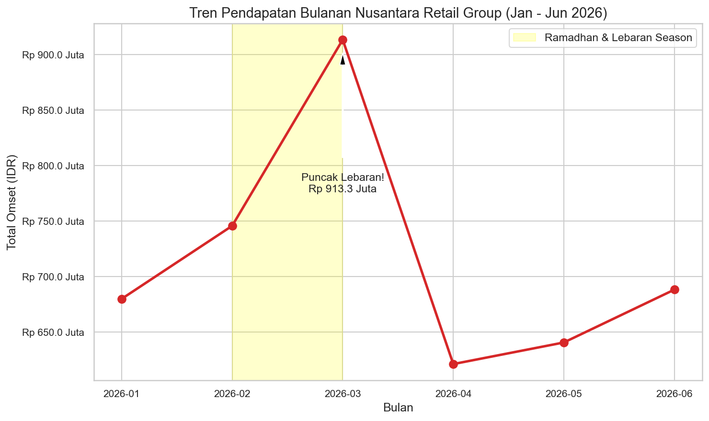
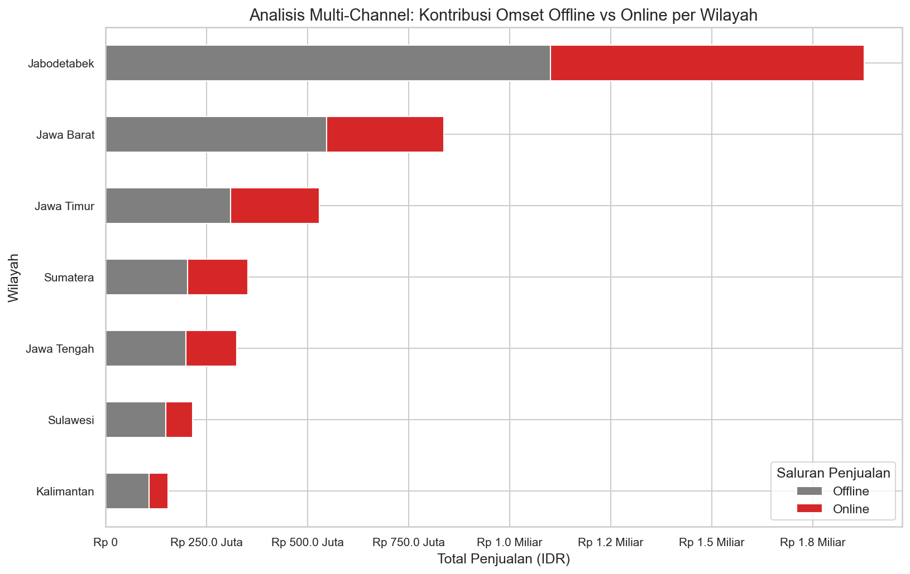
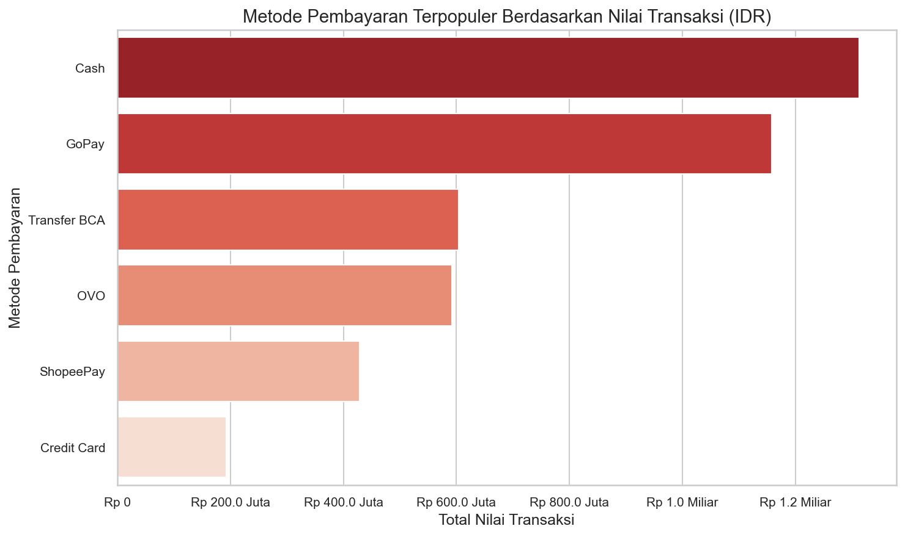
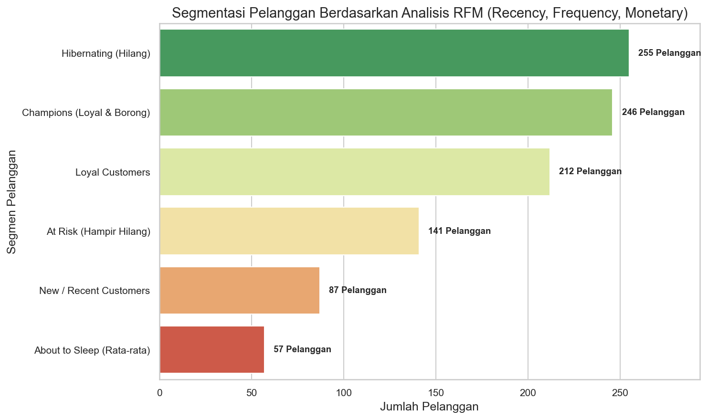

# Portfolio Project: Nusantara Retail Sales & Customer Analytics

Proyek ini adalah analisis transaksional bisnis retail multi-channel di Indonesia bernama **Nusantara Retail Group (NRG)**. Fokus utama proyek ini adalah mengidentifikasi performa penjualan regional, menganalisis perilaku belanja musiman (Lebaran Seasonality), mengevaluasi popularitas metode pembayaran e-wallet, dan melakukan segmentasi pelanggan menggunakan analisis **RFM (Recency, Frequency, Monetary)** untuk menyusun strategi pemasaran terarah.

---

## 📋 Portfolio Quick-Copy Card (Bahasa Indonesia & English)

> [!TIP]
> Bagian ini dirancang khusus untuk langsung disalin ke situs portofolio Anda (seperti CV, LinkedIn, Web Portfolio, atau GitHub Showcase).

### 🇮🇩 Versi Bahasa Indonesia
* **Judul Proyek**: Nusantara Retail Group: Sales & RFM Customer Segmentation Analysis
* **Tags (Technical)**: `Retail Analytics` | `RFM Segmentation` | `Python` | `Customer Behavior` | `Data Visualization`
* **Tags (Soft Skills)**: `Analytical Thinking` | `Business Insights` | `Data Storytelling`
* **Description**:
  Menganalisis 6.000+ data transaksi retail multi-channel di Indonesia untuk mengevaluasi kinerja penjualan semester 1 tahun 2026. Proyek ini mengidentifikasi pola musiman belanja Lebaran, memetakan kontribusi wilayah & metode pembayaran lokal (GoPay, OVO, ShopeePay), serta menyusun segmentasi pelanggan berbasis RFM untuk strategi retensi pemasaran terarah.
* **Key Insights**:
  * Mengidentifikasi lonjakan penjualan musiman (Lebaran Season) sebesar **34%** di bulan Maret mencapai **Rp 913,3 Juta**, didorong oleh kategori *Groceries* dan *Fashion*.
  * Wilayah Jabodetabek memberikan kontribusi omset terbesar (**Rp 1,87 Miliar** atau ~44% dari total), dengan saluran Offline mendominasi (60%).
  * Metode pembayaran non-tunai (E-wallet GoPay & OVO) mendominasi transaksi online, sementara Cash masih menguasai retail offline di daerah-daerah.
  * Hasil segmentasi RFM mengidentifikasi **246 pelanggan (24.6%) sebagai Champions** (kontributor utama Rp 2,08 Miliar omset) dan **141 pelanggan (14.1%) berstatus At Risk** (jarang bertransaksi kembali).
* **Outcome**:
  * Merumuskan strategi promo terarah berbasis segmen: kampanye re-engagement voucher diskon 20% khusus untuk segmen *At Risk*, program loyalitas *cashback* Gopay untuk *Champions*, serta manajemen inventaris barang 1.5x lebih awal untuk menghadapi Lebaran musim berikutnya.

### 🇬🇧 English Version
* **Project Title**: Nusantara Retail Group: Sales & RFM Customer Segmentation Analysis
* **Tags (Technical)**: `Retail Analytics` | `RFM Segmentation` | `Python` | `Customer Behavior` | `Data Visualization`
* **Tags (Soft Skills)**: `Analytical Thinking` | `Business Insights` | `Data Storytelling`
* **Description**:
  Analyzed 6,000+ multi-channel retail transaction records to evaluate sales performance in the first half of 2026. The project maps shopping seasonality (Lebaran peak), regional store contributions, local payment methods (GoPay, OVO, ShopeePay), and segments customers using RFM analysis for targeted marketing.
* **Key Insights**:
  * Identified a major seasonal sales spike of **34%** in March (peaking at **Rp 913.3 Million**), heavily driven by *Groceries* and *Fashion* during the Eid al-Fitr shopping season.
  * Jabodetabek region contributes the highest revenue (**Rp 1.87 Billion** or ~44% of total), with Offline stores driving 60% of regional sales.
  * Local e-wallets (GoPay & OVO) dominate online payments, whereas Cash remains the preferred choice for offline stores in suburban regions.
  * RFM Analysis segmented **246 customers (24.6%) as Champions** (contributing Rp 2.08 Billion in sales) and **141 customers (14.1%) as At Risk** (declining activity).
* **Outcome**:
  * Developed customer retention plans: designed 20% discount coupon re-activation campaigns for the *At Risk* segment, exclusive GoPay cashback loyalty events for *Champions*, and proposed 1.5x inventory preparation timelines prior to the next peak Lebaran season.

---

## 📌 1. Ringkasan Eksekutif (Executive Summary)
Nusantara Retail Group (NRG) merupakan perusahaan retail yang beroperasi di 7 wilayah Indonesia dengan 4 kategori produk utama: *Groceries*, *Electronics*, *Fashion*, dan *Home Living*. Untuk menyusun strategi pemasaran dan perencanaan inventaris di semester kedua 2026, tim Data Analyst mengaudit data transaksi dari Januari - Juni 2026.

**Hasil Utama Analisis:**
1. **Pola Musiman Belanja**: Terjadi lonjakan penjualan signifikan pada bulan **Februari dan Maret 2026** (Ramadhan dan menjelang Lebaran), diikuti penurunan tajam di bulan April (efek setelah lebaran/post-holiday slump).
2. **Preferensi Pembayaran**: E-wallet (GoPay, OVO, ShopeePay) memegang porsi sangat besar dalam total volume transaksi, menunjukkan penetrasi digital payment yang sukses di Indonesia.
3. **Analisis Pelanggan RFM**: Mayoritas pendapatan disokong oleh segmen kecil pelanggan loyal (*Champions*). Namun, terdapat **25.5% pelanggan hilang (*Hibernating*)** dan **14.1% pelanggan terancam hilang (*At Risk*)** yang membutuhkan tindakan penyelamatan segera.

---

## 📁 2. Struktur Proyek
```text
sales_performance_project/
│
├── data/
│   ├── customer_data.csv               # Data profil demografis pelanggan
│   ├── retail_sales_transactions.csv   # Data transaksi penjualan rupiah
│   └── rfm_results.csv                 # Output hasil segmentasi RFM
│
├── scripts/
│   ├── generate_sales_data.py          # Skrip pembuat data transaksional
│   └── analyze_sales.py                # Skrip pengolahan data dan analisis RFM
│
├── visualizations/
│   ├── monthly_sales_performance.png   # Grafik tren pendapatan bulanan
│   ├── sales_by_region_channel.png     # Grafik kontribusi daerah & channel
│   ├── payment_method_distribution.png # Grafik metode pembayaran terpopuler
│   ├── rfm_customer_segments.png       # Grafik klasifikasi segmen pelanggan
│   └── portfolio_banner.png            # Cover visual portofolio proyek
│
└── README.md                           # Dokumentasi ini
```

---

## 📈 3. Visualisasi Hasil & Analisis Grafik

### A. Tren Penjualan Bulanan
Grafik ini melacak total omset penjualan bulanan dari Januari hingga Juni 2026.



* **Analisis**:
  * Penjualan melonjak tajam mulai Februari (**Rp 745,8 Juta**) dan memuncak di Maret (**Rp 913,3 Juta**). Hal ini bertepatan dengan musim belanja Ramadhan dan Lebaran di Indonesia.
  * Bulan April mengalami penurunan drastis ke **Rp 621,4 Juta** karena siklus konsumsi yang menurun pasca-Hari Raya.

---

### B. Kontribusi Wilayah & Saluran Penjualan (Offline vs Online)
Grafik ini membandingkan total penjualan di 7 wilayah operasional, dipecah berdasarkan saluran pembelian.



* **Analisis**:
  * **Jabodetabek** adalah kontributor utama pendapatan dengan total omset mencapai **Rp 1,87 Miliar**, diikuti Jawa Barat (**Rp 837 Juta**) dan Jawa Timur (**Rp 529 Juta**).
  * Penjualan toko fisik (*Offline*) mendominasi di seluruh wilayah (~55% - 60%), namun wilayah Jawa Barat dan Jabodetabek memiliki adopsi belanja *Online* yang cukup tinggi (~40%).

---

### C. Metode Pembayaran Terpopuler
Grafik horizontal ini menunjukkan distribusi nilai transaksi berdasarkan metode pembayaran yang digunakan pelanggan.



* **Analisis**:
  * Metode pembayaran **Cash** masih memimpin dengan total **Rp 1,31 Miliar**, karena tingginya transaksi belanja offline di supermarket.
  * Namun, **GoPay** berada di posisi kedua dengan kontribusi luar biasa sebesar **Rp 1,15 Miliar**, disusul **Transfer BCA** (Rp 604 Juta) dan **OVO** (Rp 592 Juta). Ini menandakan integrasi pembayaran non-tunai (Qris/E-wallet) sangat diterima oleh pelanggan Nusantara Retail Group.

---

### D. Segmentasi Pelanggan RFM
Pelanggan diklasifikasikan menggunakan kuantil dari nilai Recency (R), Frequency (F), dan Monetary (M).



* **Analisis**:
  * **Hibernating (255 pelanggan)**: Segmen terbesar. Mereka adalah pelanggan yang sudah lama tidak belanja dan frekuensinya sedikit. Perlu dianalisis apakah ada kendala layanan atau kompetitor baru.
  * **Champions (246 pelanggan)**: Kontributor finansial terbesar bagi perusahaan. Mereka baru saja belanja, sangat sering belanja, dan berbelanja dalam jumlah besar.
  * **At Risk (141 pelanggan)**: Pelanggan yang dulu sering belanja banyak, namun sudah cukup lama tidak kembali. Ini adalah target utama kampanye re-aktivasi.

---

## 📝 4. Kesimpulan & Rekomendasi Bisnis
Berdasarkan hasil temuan analisis di atas, berikut adalah rekomendasi taktis bagi Nusantara Retail Group:

1. **Strategi Stok Musiman Lebaran**: Tim logistik dan pengadaan harus mempersiapkan peningkatan stok barang (khususnya kategori *Groceries* dan *Fashion*) sebesar 1.5x lebih awal (mulai awal Januari) guna menghindari kekosongan stok (*out-of-stock*) saat puncak belanja Ramadhan di bulan Februari/Maret.
2. **Kampanye Re-Engagement Segment "At Risk"**: Lakukan promosi khusus melalui email marketing atau push notification dengan voucher "We Miss You" berupa potongan harga 20% untuk menarik kembali 141 pelanggan di segmen *At Risk* sebelum mereka beralih ke kompetitor.
3. **Kemitraan Strategis Gopay/OVO**: Karena GoPay dan OVO merupakan metode pembayaran digital terpopuler, jalankan program *exclusive cashback* bersama GoTo/OVO di akhir pekan untuk meningkatkan volume transaksi di aplikasi online.
4. **Ekspansi Digital Regional**: Meskipun toko offline mendominasi wilayah luar Jawa (Kalimantan, Sulawesi), terdapat potensi pasar online yang belum tergarap optimal. Lakukan promosi digital tertarget di daerah-daerah tersebut dengan menawarkan subsidi ongkos kirim (ongkir).
